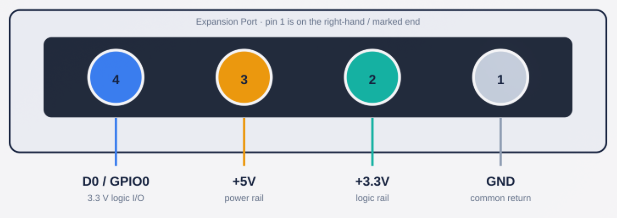

## What is the purpose of the expansion port on the Grumpy Board?
The expansion port on the Grumpy Board allows for additional functionality and sensors. It provides a simple way to connect sensors, like the tempture sensor's, wind sensor, rain sensor. Along with more advice features like Celluar modem's.

## How does the expansion port work?

Below is a diagram of the Expansion Port on the Grumpy Board, It's a 4 pin JST-PH connected that prodives 3.3v and 5v power along with 1 data pin for I2C communication.

## How do I interact with the expansion port?

The Grumpy Board has firmware built avilable via the flasher for a standard i2c tempture sensor, the firmware for the Grumpy board is open source and welcome to have additonal sensor support added.

You can also make a Github issue on this repository if you would like for us to help you intergrate your sensor or device.
